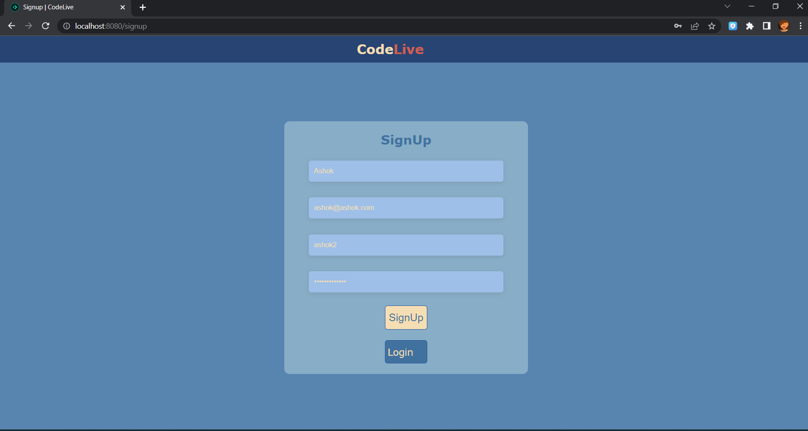
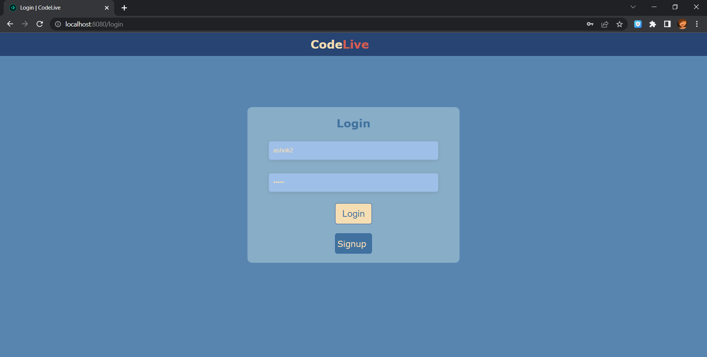
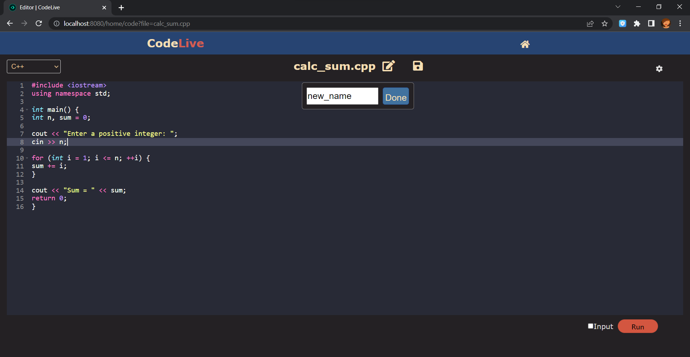

<h1 align="center">🚀 CodeLive Studio</h1>
<p align="center">🌐 Online Multi-Language Code Editor & Compiler</p>

<p align="center">
  
  
</p>

---


---

# 🌐 Your Cross-Platform Coding Environment

**CodeLive Studio** is a modern, browser-based **Integrated Development Environment (IDE)** and **multi-language compiler** designed for:

- Students  
- Competitive programmers  
- Software developers  

Enjoy a seamless experience to **Write ➝ Run ➝ Save ➝ Succeed** — all inside your browser. ✨

---

# 🌟 Key Features

## 🔐 Authentication & Personalized Workspace
- Simple and secure **Signup & Login**
- Robust session handling using **express-session**
- Each user receives a **dedicated workspace**
- All files stored **persistently** on MongoDB Atlas  

---

## 📝 Smart Code Editor (Ace Editor)
- 🎨 Syntax Highlighting  
- ⚡ Real-time Editing  
- 🧠 Smart Indentation  
- 💾 Auto Save Support  
- 🌈 Clean and accessible UI  

---

## ⚡ High-Speed Code Execution Engine

Supports and executes:

- **C**
- **C++**
- **Python**
- **JavaScript**

Features:

- Custom input field  
- Automatic compilation (C/C++)  
- Execution logs & error handling  
- Optimized for Linux-based deployment (Render)  

---

## 📂 Persistent File Management
- ➕ Create  
- ✏ Edit  
- 🗑 Delete  
- 📁 Stored securely using MongoDB Atlas  
- Available across all sessions  

---

# 🛠 Tech Stack Breakdown

| Layer | Technology | Purpose |
|-------|------------|---------|
| 🎨 Frontend | HTML, CSS, JavaScript, Ace Editor | Editor UI, syntax highlighting |
| ⚙ Backend | Node.js, Express.js | Routing, file handling, session management |
| 🗄 Database | MongoDB Atlas | Cloud storage for users & files |
| 🔒 Session/Auth | express-session | User authentication |
| 💻 Compilers | GCC, G++, Python, Node | Code execution |
| ☁ Deployment | Render | Hosting & runtime |

---

# 📸 Screenshots

### 🆕 Signup  


### 🔑 Login  


### 💻 Code Editor  


---


## 🔧 Prerequisites

Ensure your system has:

- Node.js (LTS Recommended)
- MongoDB Atlas account or local MongoDB
- GCC, G++, Python installed (for local code execution support)

---

## 1️⃣ Clone the Repository

```bash
git clone https://github.com/kanhaiya-22/CodeLive-Studio.git
cd CodeLive-Studio


🤝 Contribution

If you find a bug or have a feature request, please open an issue!
We welcome contributions to help make CodeLive Studio even better.

Steps to contribute:

- Fork this repository

- Create a new branch

- Make your changes

- Submit a pull request 🎉
